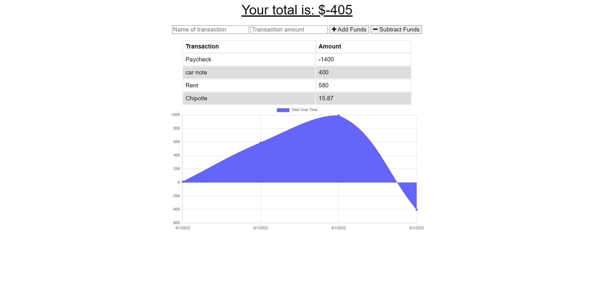

# Spending Buddy

## Description
This is an interactive web app that tracks the amount of money designated by the user and subtracts or adds funds as they imput values.

## Technologies

 
with the following npm packages
* `express.js`
* `mongoose`
* `compression`
* `morgan` 

## Preview
https://intense-reef-75277.herokuapp.com/

### Screenshot
